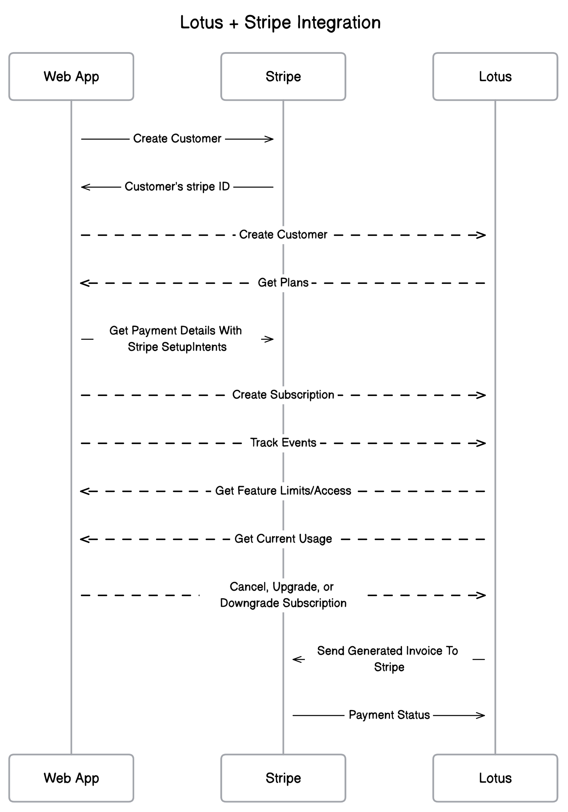

# Stripe

Most startups use Stripe to manage their payments. Lotus lets you keep the most convenient part of Stripe (processing payments and sending invoices), while also letting you seamlessly transition off their services that are incurring costs you don't even think about.

You could be paying anywhere from 0.9% to 1.3% of your revenue to Stripe by using their Billing and Invoicing services, on top of the 2.9% + 30¢ fee they charge for every transaction. With Lotus, you can pick and choose which parts of Stripe you want to keep, and which parts you want to replace with a more cost-effective solution.

Lotus is a single source of truth for subscriptions, pricing, and packaging. Once an invoice is generated you can use Stripe to collect the payment from the customer.

### Migrating Products from Stripe to Lotus Is Simple

The Stripe integration currently supports:

- Importing your customers from Stripe. Customers are matched by email address, so make sure your Stripe customers have email addresses.

- Importing your invoices from Stripe. If you want to see how much customers have paid right on the Lotus app, this could be a great option for you.

- Transferring subscriptions from Stripe to Lotus. We allow you to transfer them immediately by canceling the Stripe subscription or switching over to Lotus at the end of the billing period. We do this automatically by looking at your Stripe product IDs and price IDs and matching them to the Lotus plans you have created. For more details, see the plan information section of the Creating a Plan guide.

### How the Stripe x Lotus Integration Works

