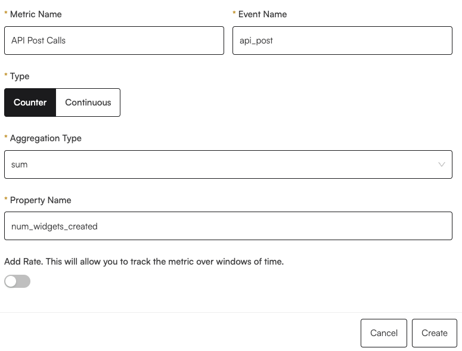
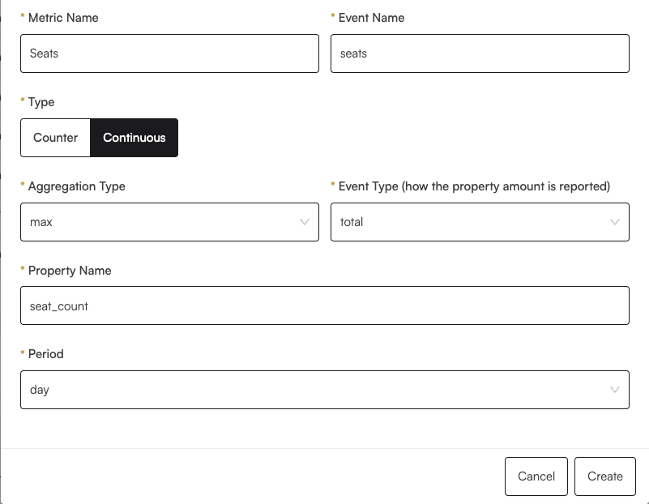
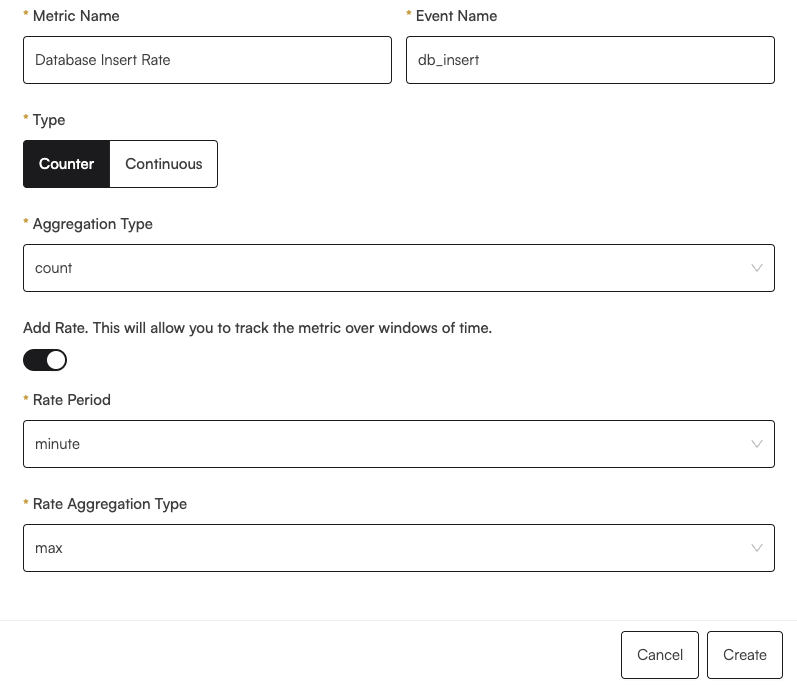

# Create Metrics

Creating billable metrics is the first step in setting up your pricing on Lotus. Metrics represent everything that you want to track in your software. Some of the most common metrics you can define are users/seats, API calls, and gb of storage.

Metrics can be as complex as you need to be and come in a few basic types.

1. **Counter**

   A counter metric is an aggregation (think `SUM`, `COUNT`, `MAX`, or other SQL-like aggregations) over events or the properties of events. For example, you could keep track of the `COUNT` of API calls made to your service, or the `SUM` of bytes uploaded to your service.

2. **Continuous**

   The key difference between a counter and a continuous metric is what the events represent. Whereas in a counter we aggregate over the events, in a continuous, the events are simply informing us about updates to some underlying state. For example, the number of seats currently active, or the storage currently in use. We don't actually aggregate over the events themselves, but rather over the state that they represent

3. **Rate**

   Rate metrics are very similar to counter metrics. Whereas counter metrics aggregate over events that occur in a billing period, a rate keeps track of windowed time periods of finer granularity than the entire billing period. For example, if you were running a database company, your monthly plan might include a rate metric that represents the number of database inserts per minute.

### Counter Metrics

Defining a counter metric starts with defining the `metric_name`(display name for your metric) and `event_name`, the name of events that will be used to calculate the metric. For more details about how to log events and how to pass in an event name, please refer to the [Logging Events](./logging-events.mdx) section.

Next, define the aggregation type. To pick an aggregation type, think about how you want to pass in usage information as events into Lotus. Many of the aggregation types depend on you passing in certain key/value pairs in the properties.

The allowed aggregation metrics are:

<p>

- <code>COUNT</code>

  - A simple count over the total number of events recorded during the billing period.

- <code>UNIQUE</code> <b>:property field required </b>

  - Count the distinct number of values that the property had during the billing period.

- <code>SUM</code> <b>:property field required </b>

  - Sum over a certain property of each event

- <code>MAX</code> <b>:property field required </b>

  - Take the max of a certain property field over all events.

</p>

### Continuous Metrics

<p>

Defining a continuous metric also starts with defining the <code>event_name</code>, <code>metric_name</code>, and <code>event_type</code>.

Lotus currently supports two <code>event_type</code>s:

- <code>DELTA</code>: The event represents a change in the underlying state. For example, the events could represent the change in the number of active seats, and could have values like <code>+1</code> or <code>-2</code> to represent a seat(s) being added or removed.
- <code>TOTAL</code>: The event represents the current value of the underlying state. For example, the events could represent the total gigabytes of storage a customer is using, and could have values like <code>10</code> or <code>50</code> to represent the total.

Continuous metrics additionally require a <code>granularity</code> field. This field specifies the size of the smallest time periods you want to track your metric over. The allowed values are:

- <code>hour</code>
- <code>day</code>
- <code>week</code>
- <code>total</code>

For example, you may want to have a continuous metric that tracks the number of seats currently active. However, sometimes companies want to prorate at a smaller interval. For example, Notion's pricing states:

> If you added members, your account will be charged a prorated amount based on the percentage of the billing cycle left at the time each member was added. If you removed members, your account will be credited in the same way.
>
> — [Notion](https://www.notion.so/pricing)

In this case, you would set the granularity to <code>day</code>, and we would automatically take care of the rest. If you're not interested in prorating, then you can set the granularity to <code>total</code>.

Currently, we provide two types of aggregations for billing:

- <code>MAX</code> <b>:property field required </b>

  - Take the max of the state over the <code>granularity</code> period.

- <code>LAST</code> <b>:property field required </b>

  - Take the latest value of the state over the <code>granularity</code> period.

</p>

### Rate Metrics

<p>

Defining a rate metric also starts with defining the <code>event_name</code> and <code>metric_name</code>.

Rate metrics also require a <code>granularity</code> field. This field specifies the size of the smallest time periods you want to track your metric over. The allowed values are:

- <code>minute</code>
- <code>hour</code>
- <code>day</code>

For example, you may have a metric that tracks the number of rows inserted into your database. If you only wanted to allow a certain number of database inserts per hour, you would set the granularity to <code>hour</code>.

To calculate whether a customer has exceeded their rate limit, you must specify an <code>aggregation_type</code>. The allowed values are:

- <code>COUNT</code>

  - A simple count over the total number of events recorded during the rate period.

- <code>SUM</code> <b>:property field required </b>

  - Sum over a certain property of each event.

- <code>MAX</code> <b>:property field required </b>

  - Take the max of a certain property field over all events in the rate period.

Additionally, we need another aggregation, <code>rate_aggregation</code>, to arrive at a final "usage number" for the billing period, derived from all the windowed periods of length `granularity`. The allowed values are:

- <code>MAX</code> <b>:property field required </b>

For example, if you wanted to charge on a rate metric with an `hour` granularity and `count` aggregation, we would charge based on the maximum number of events seen over all sliding windows of 1 hour.

We are currently working on adding support for more aggregation types.

</p>

### Examples

#### Counter Metric

The following example shows a counter metric that takes in events called `api_post`. At the end of the billing period, we will take the `SUM` of the property `num_widgets_created` over all these events. That will be a customer's usage for the billing period. We will later define how to transform that usage quantity into a price, specifically when creating [plan components](../plan-management/creating-plans.md).



This is an example of what an event might look like:

```json
{
  "event_name": "api_post",
  "customer_id": "cust_123",
  "properties": {
    "num_widgets_created": 14,
    "time_taken": 0.5,
    "project_id": "123456"
  }
}
```

#### Continuous Metric

The following example shows how we might implement a continuous metric that tracks the number of active seats in a company. Because we have an aggregation type of `max` and a period of `day`, we will calculate the maximum number of seats seen over each day. In essence, we will be tracking user-days. Because we have an event type of `total`, the specified property will represent the current value of the number of seats. Again, this is simply a definition of the metric. We will later define how to transform that usage quantity into a price, when creating [plan components](../plan-management/creating-plans.md).



This is an example of what an event might look like:

```json
{
  "event_name": "seats",
  "customer_id": "cust_123",
  "properties": {
    "seat_count": 4,
    "seat_change": -1,
    "admin_seat": true
  }
}
```

#### Rate Metric

This example shows how we might implement a rate metric that tracks the number of rows inserted into a database. Because we have an aggregation type of `count` and a period of `minute`, the usage is defined as the numebr of events seen per minute on a rolling window. Further, we also have a rate aggregation type. This specifies that over all rolling 1-minute periods, we will take the one with the maximum count of `db_insert` events and use that as the usage for the billing period. Again, this is simply a definition of the metric. We will later define how to transform that usage quantity into a price, when creating [plan components](../plan-management/creating-plans.md).



This is an example of what an event might look like:

```json
{
  "event_name": "db_insert",
  "customer_id": "cust_123",
  "properties": {
    "table_name": "record_table",
    "num_rows": 10,
    "kb_size": 10
  }
}
```
