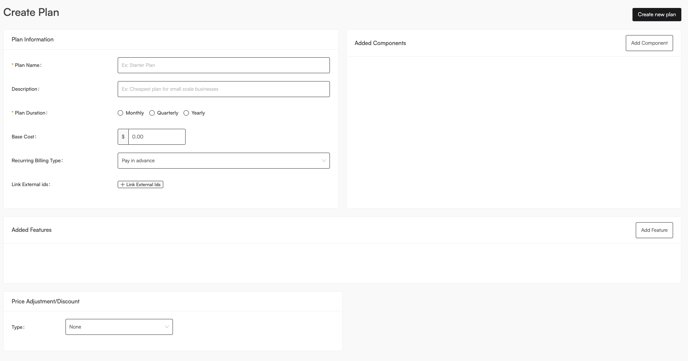
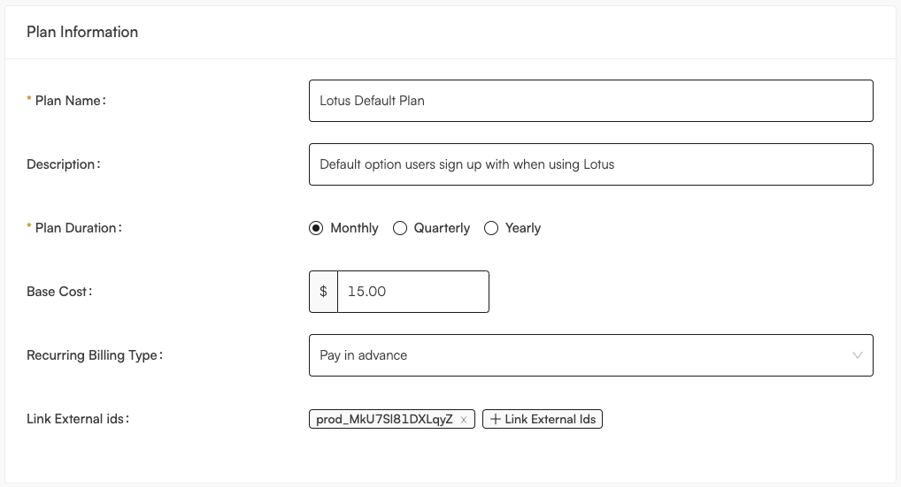
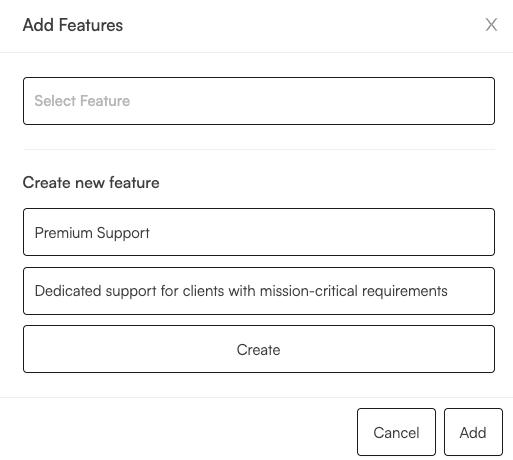

# Create Pricing Plans

Once you have defined your value [metrics](../metering/creating-metrics.md), it's time to combine them to form a cohesive package that you can deliver to your customers. In other words, let's create a plan! This is what the plan creation page looks like:

It might look like a lot, but lets break it down!

## Plan Information

This section has metadata about your plan, including it's name and description, billing frequency information, and the flat subscription fee any customers on this plan will pay per billing period. One of Lotus' core concepts is [plan versioning](./versioning.md), so keep in mind that when you make new versions of the same plan, the only two things you can't change are the plan name and the plan duration. Everything else is fair game!

Additionally, we know thet you might have existing subscriptions associated with a payment provider (such as [Stripe](../external-integrations/stripe.md)), so we allow you to link this plan to any ID that represents a plan in your payment provider. This is useful for when you want to migrate your existing subscriptions to Lotus.

For example, in Stripe, [Prices](https://stripe.com/docs/api/prices) and [Products](https://stripe.com/docs/api/products) together specify what you might consider a "plan" in Lotus, so if you had a product with id `prod_MkU7Sl81DXLqyZ` in Stripe, you could link them togetehr by adding it to the `Link External ids` field. No subscriptions will be migrated untilo you insruct us to do so, but this will allow you to keep track of which plans are linked to which external ids.

## Plan Components

Plan components associate billable metrics to your given plan, and include the price you want to charge for them. In the component creation screen, you must choose the metric you want to associate with this component, and decide on two things:

- Do you want to charge for this metric? If so, click the "Charge for this metric" toggle. You'll have to specify the number of free units before you start billing, the price per batch, and the units of this metric per batch. In teh example above, we are charging 50 cents per 60 seconds of compute time, with teh first 5 minutes being freee.

- Do you want to set a limit on this metric? If so, click the "Does this metric have a limit?" toggle. You'll have to specify the max number of units you want to allow for this metric. In the example above, we are capping this plan at 10,000 seconds of compute time. For more details on how you can track customer usage levels for feature gating, please refer to the [managing feature access](../subscription-lifecycle/managing-access.md) guide.

## Features

Plan features are meant to represent boolean features that you want to enable for your customers. For example, you might want to enable a feature like "Advanced Reporting" for a customer on a certain plan. In the feature creation screen, you must either choose the feature you want to associate with this plan, or create a new one. For mroe detail on how you can use plan features to enable or disable certain features in your application, please refer to the [managing feature access](../subscription-lifecycle/managing-access.md) guide.

## Price Adjustments

Price adjustments give you the flexibility to easily represent business events such as sales, negotiated prices with large enterprises, or discounts for early adopters. In the price adjustment creation screen, you must choose the type of price adjustment you want to create, and then specify the amount of the adjustment. Currently, we support the following types of price adjustments, all at the plan level (coming to the component level soon!):

- **Percentage**: This is a percentage discount or surcharge that will be applied to the total price of the plan. For example, if you want to give a 10% discount to all customers on this plan, you would specify a percentage of -10.

- **Fixed Amount**: This is a flat discount or surcharge that will be applied to the total price of the plan. For example, if you want to give a $200 discount to all customers on this plan, you would specify a flat amount of -200. Keep in mind flat discounts will never give a credit to a customer, and will simply make the invoice 0.

- **Price Overwrite**: This is a fixed price that will be applied to the total price of the plan. For example, if you negotiated a contract worth $3,000 with a large enterprise customer, you could overwrite the usage based charges and charge them a flat fee instead.
