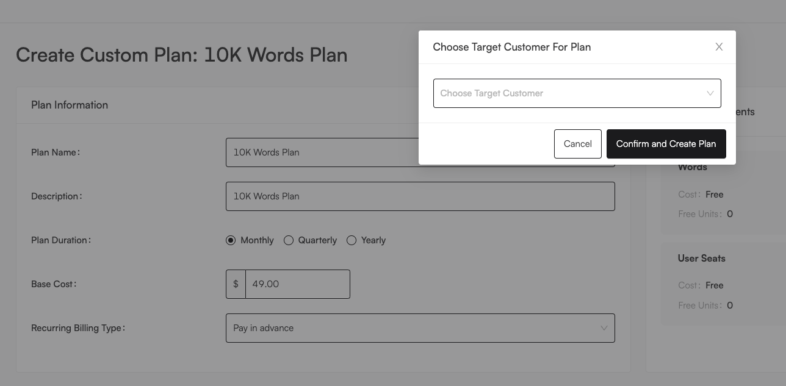

# Plan Templates

Sometimes, you might want to give a customer a plan that is only a slight variation of an existing one. For example, for an enterprise customer, you might want to increase the base fee of a plan, and include the extra feature of "Dedicated Support". In that case, you can select the existing plan as a template, then make the necessary changes to the plan, and attach it to a specific customer, as seen below:

