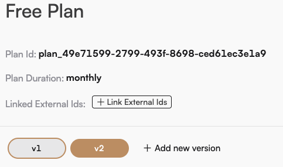

# Plan Versioning

Pricing is one of the most important levers for growth, and it's important to be able to iterate on your pricing and packaging strategy smoothly and with minimal engineering headaches. Using Lotus' plan versioning feature, you can easily create new versions of your plans, and control the behavior of users who are on older versions of your plans.

Our versioning system works by having all versions of a plan be either `active` (displayed by default when you list all plans, used to sign up a customer if you only specify a plan id and not a specific version), `grandfatehred` (no longer displayed by default, but still available to customers who are already on that plan), and `inactive`/`archived` (no active subscriptions, the only difference is archived won't show up in the versions screen in order to reduce clutter).

Currently we support:

- Transferring all users currently on a plan to the newest version at renew time, or immediately

- Marking the currently actrive version as "grandfathered" before replacing it with a new active version, menaing that users on that version will not be automatically transferred to any new version until you specify otherwise

- Creating plan versions as inactive, giving you the flexibility to [run backtests](../experimentation/backtests) or do other necessary testing before making a plan version active

